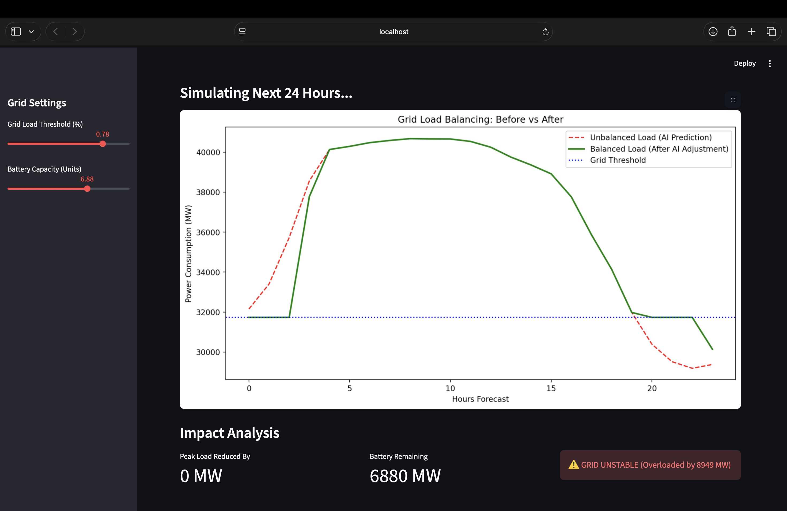

# ⚡ Smart Grid Load Balancing System

An AI-powered application that predicts energy demand and optimizes battery usage to stabilize the electrical grid.

## 🎯 Project Goal
To demonstrate how Machine Learning can be used to perform "Peak Shaving"—reducing stress on the power grid during high-demand hours.

## 🛠 Tech Stack
* **Python 3.9**
* **Machine Learning:** Scikit-Learn (Random Forest Regressor)
* **Data Processing:** Pandas, NumPy
* **Visualization:** Streamlit, Matplotlib

## 🚀 How It Works
1.  **Ingest:** Loads historical hourly energy data (PJM East Region).
2.  **Predict:** Uses a Random Forest model to forecast the next 24 hours of demand.
3.  **Optimize:** Applies a logic layer to discharge batteries when demand > threshold.
4.  **Visualize:** Displays the "Before vs. After" load curves in an interactive dashboard.

